# Scatter-plots 

The basic plotting functions are very easy, but we first need some data to work with. For this example we are going to use one of the inbuilt datasets.

There are a number of datasets which come readily loaded with the `datasets` package. In this example we are using the `trees` dataset, which contains 'measurements of the girth, height and volume of timber in 31 felled black cherry trees' (See `?trees` for more information)

First, we will look at the data.


```r
trees
```

```
##    Girth Height Volume
## 1    8.3     70   10.3
## 2    8.6     65   10.3
## 3    8.8     63   10.2
## 4   10.5     72   16.4
## 5   10.7     81   18.8
## 6   10.8     83   19.7
## 7   11.0     66   15.6
## 8   11.0     75   18.2
## 9   11.1     80   22.6
## 10  11.2     75   19.9
## 11  11.3     79   24.2
## 12  11.4     76   21.0
## 13  11.4     76   21.4
## 14  11.7     69   21.3
## 15  12.0     75   19.1
## 16  12.9     74   22.2
## 17  12.9     85   33.8
## 18  13.3     86   27.4
## 19  13.7     71   25.7
## 20  13.8     64   24.9
## 21  14.0     78   34.5
## 22  14.2     80   31.7
## 23  14.5     74   36.3
## 24  16.0     72   38.3
## 25  16.3     77   42.6
## 26  17.3     81   55.4
## 27  17.5     82   55.7
## 28  17.9     80   58.3
## 29  18.0     80   51.5
## 30  18.0     80   51.0
## 31  20.6     87   77.0
```

So far so good. To produce a basic scatter plot in R is very simple. We use the `plot` command. In this example, we need to specify which parts of the trees dataset we are going to use. Just as revision, we will try three different ways of doing this - all will produce the same plot, but each one has a subtly different use.

In the first example, we select a subscript from the dataframe using square brackets `[,1]`. Refer back to <a href="Tutorial/getting_data_into_R.html">Getting data into R</a> if you are unsure. This can be a useful way to select data from a larger dataset, if for instance we are dealing with matrices.


```r
plot(
     x = trees[,1],
     y = trees[,2]
     )
```

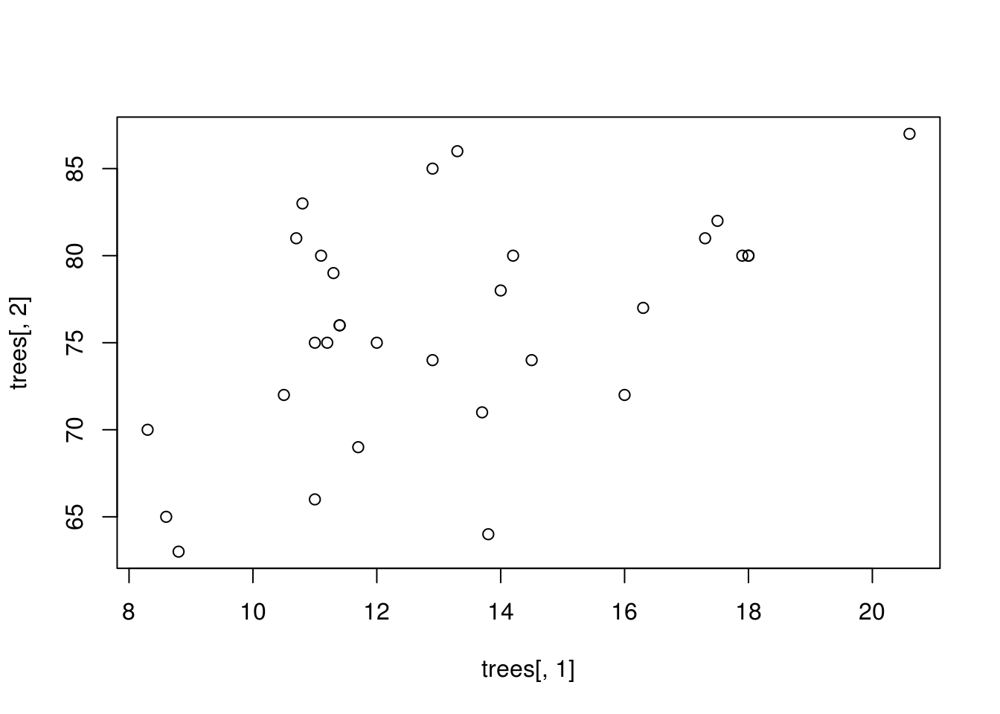

The second way, we will use the `$` operator to select a column from within the dataframe:


```r
plot(
     x = trees$Girth,
     y = trees$Height
     )
```

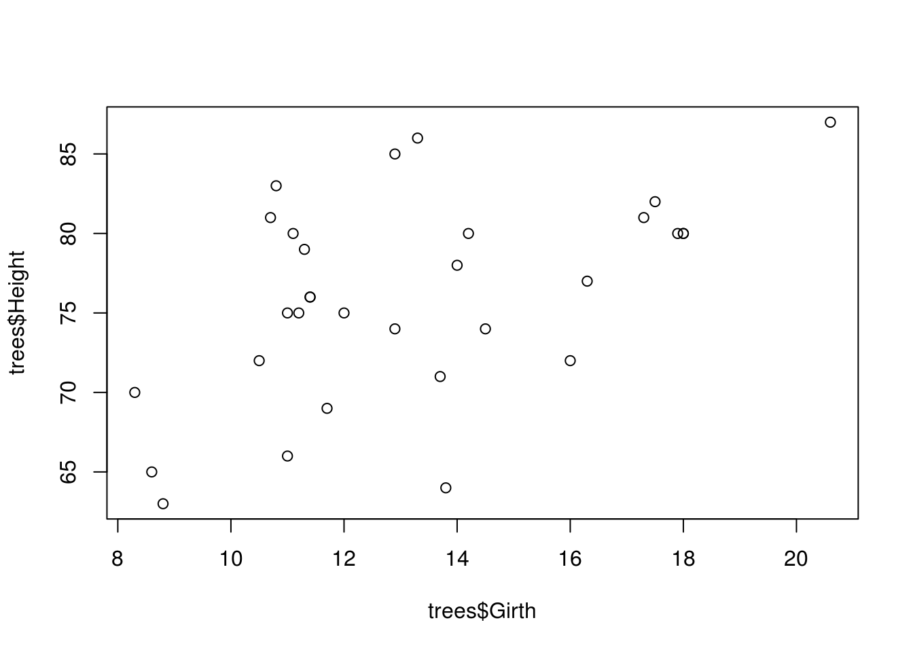

And finally, we can try the `with()` function. Using `with()` dispenses with the need for the `$` operator, and allows us to call objects within a dataframe without specifying the name of the dataframe every time.


```r
with(
     trees,
     plot(
          x = Girth,
          y = Height
          )
     )
```

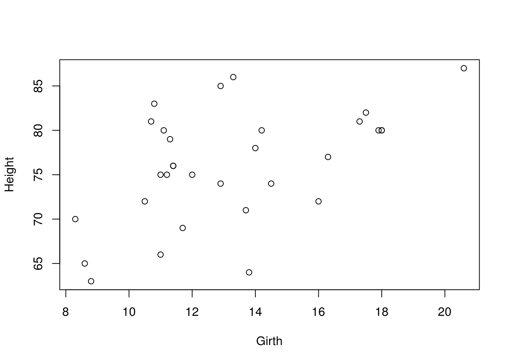

It doesn't really matter which method you use in this example, but it is useful to revise different ways of getting at data within a dataframe

This plot is not particularly inspiring, so let's look at some of the ways we can make it nicer.

Within the `plot` command, there are a number of arguments that we can change in order to alter the appearance of the plot, these are [here](plot_arguments.html), lifted from the help file for `?plot`. You can get a similar list of arguments for any of the other plot functions (or indeed any function) by calling up the help file for that function (just place a "?" in front of the function: e.g. `?boxplot`).


### Point colour and shape 

So lets change some general things first. We'll label the axes (`xlab` or `ylab`)  and change the shape (`pch`) and colour (`col`) of the points.


```r
with(
     trees,
     plot(
          x = Girth,
          y = Height,
          xlab = "Girth (in)",
          ylab = "Height (ft)",
          pch = 16,
          col = "red"
          )
     )
```

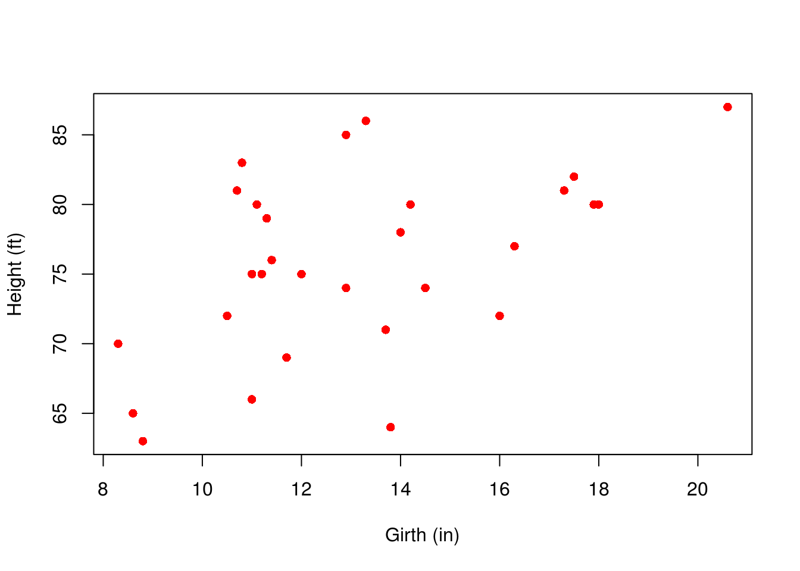

A little bit better...

Note that there a wide range of symbol shapes available...

[](http://rgraphics.limnology.wisc.edu/images/miscellaneous/pch.png)

...and pretty much any colour you can imagine. Colours can either be specified as a name (e.g. "red"), as a hexadecimal code (e.g. `col = "#FF0000"`) or in RGB format (e.g. `col = rgb(1, 0, 0)`). Try [http://www.colorpicker.com/](http://www.colorpicker.com) if you get stuck. Note that unless you are going to pay for colour figures in journal plates, or you can be sure that no colour blind people will read your work, it is good practice to use a combination of colours and symbols

We can use the package `RColorBrewer` to make picking complementary colour palettes a little easier. See `?RColorBrewer` or [http://colorbrewer2.org](http://colorbrewer2.org) for more information. There are a number of palettes for different applications. We will just use the first of them - this palette is good for colouring lines and points, but should be avoided for blocks of colour.


We can see the various palettes with:


```r
display.brewer.pal(
     n = 9,
     name = "Set1"
     ) 
```

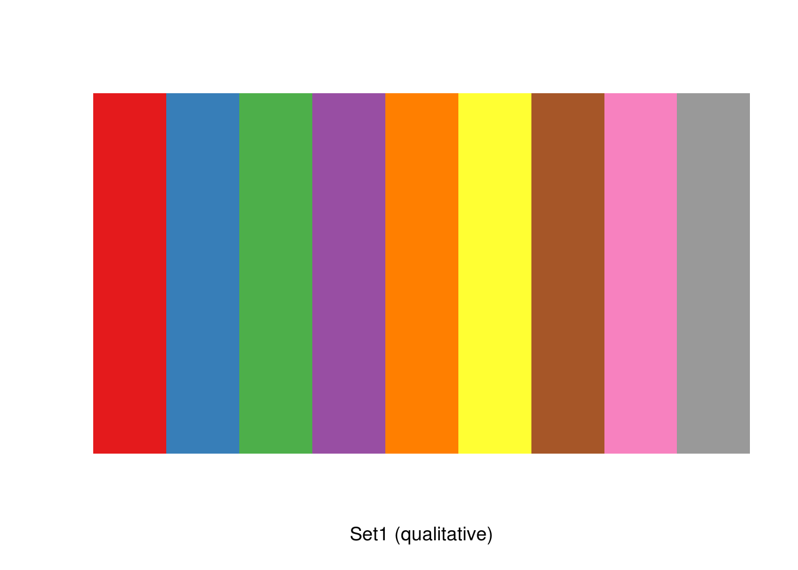

And create our palette with:


```r
pal <- brewer.pal(
     n = 9,
     name = "Set1"
     )
```

Note that `RColorBrewer` specifies colours with hexadecimals:


```r
pal
```

```
## [1] "#E41A1C" "#377EB8" "#4DAF4A" "#984EA3" "#FF7F00" "#FFFF33" "#A65628"
## [8] "#F781BF" "#999999"
```

### Axes and outlines 

We are also able to customise the axes in any way we want, but it is usually necessary to remove the axes altogether with `xaxt="n"` and/or `yaxt="n"` and replace them with the `axis` command.

This example also demonstrates the use of the `bty` argument.


```r
with(
     trees,
     plot(
          x = Girth,
          y = Height,
          xlab = "Girth (in)",
          ylab = "Height (ft)",
          pch = 16,
          col = pal[2],         # second colour from the palette we produced.
          yaxt = "n",           # remove the y axis
          xaxt = "n",           # remove the y axis
          cex.lab = 1.2,      # scaling factor relating to the size of axis titles.
          cex = 1.4,          # scaling factor for the size of points
          bty = "l"             # this can be either "o", "l" or "u"
          )                   # and affects the box bordering the plot
     )

axis(
     side = 1,           # 1=below, 2=left, 3=above and 4=right.
     at = seq(0,20,4),   # a sequence denoting the location of axis tick marks
     cex.axis = 1.2      # a scaling factor of the default text size
     )
axis(
     side = 2, 
     at = seq(50,100,5), 
     las = 2,            # Rotate axis labels
     cex.axis = 1.2
     )
```

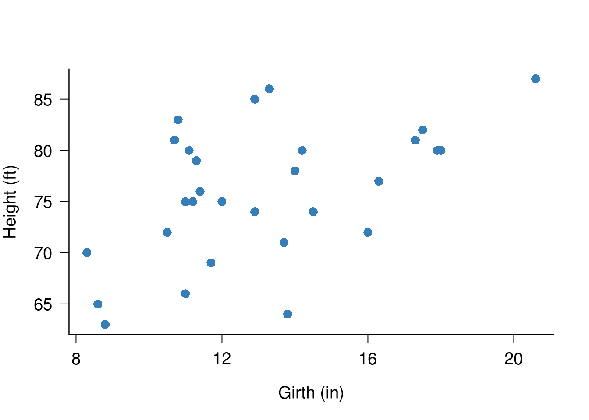

### Additional observations 

If we want to add additional observations to a plot, it is quite simple. We can use the `points` command, which is specified in a very similar way to the original `plot` command.

In this example, we will use the same `trees` dataset and plot as the previous example, but we will add a second set of observations which we have simulated using `jitter`. The `jitter` command adds a small amount of 'noise' to an observation by adding or removing a small amount from it.


```r
# Repeat the same code as the last example:

with(
     trees,
     plot(
          x = Girth,
          y = Height,
          xlab = "Girth (in)",
          ylab = "Height (ft)",
          pch = 16,
          col = pal[2],         # second colour from the palette we produced.
          yaxt = "n",           # remove the y axis
          xaxt = "n",           # remove the y axis
          cex.lab = 1.2,      # scaling factor relating to the size of axis titles.
          cex = 1.4,          # scaling factor for the size of points
          bty = "l"             # this can be either "o", "l" or "u"
          )                   # and affects the box bordering the plot
     )

axis(
     side = 1,           # 1=below, 2=left, 3=above and 4=right.
     at = seq(0,20,4),   # a sequence denoting the location of axis tick marks
     cex.axis = 1.2      # a scaling factor of the default text size
     )
axis(
     side = 2, 
     at = seq(50,100,5), 
     las = 2,            # Rotate axis labels
     cex.axis = 1.2
     )

# Add an additonal set of points:

with(
     trees,
     points(
          x = jitter(Girth, amount=2),       # See ?jitter for details
          y = jitter(Height, amount = 2),
          pch = 15,
          col = pal[1],
          cex = 1.4
          )
     )

# We also now need to add a legend:

legend(
     "bottomright",      # this can also take the form of x and y coordinates
     legend = c("Jittered","Original"), # labels for the legend
     col = pal[1:2],     # colour in order of appearance
     pch = c(15:16),     # pch in order of appearance
     pt.cex = 1.4,       # size of legend points
     bty="n"             # remove the black outline from the legend
     )
```

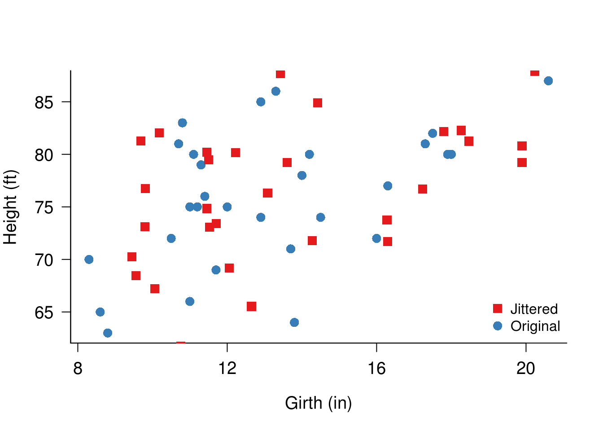

Note that in the above example we would need to adjust the limits of the x and y axes in order to accommodate all of the extra points which we added. This can be done with the arguments `xlim=c(1,2)` or `ylim=c(1,2)`, substituting the lowest and highest numbers for the 1 and 2.

### Log transformations 

It is sometimes necessary to transform your data when plotting. This is quite easy to achieve in R.

In this example, we will import directly from an online text file (also from Crawley's R book).


```r
sapdecay <- read.table(
     "http://www.bio.ic.ac.uk/research/mjcraw/therbook/data/sapdecay.txt", 
     header = T
     )
```

 We'll call the data to examine it. Note this data is dealt with on p70 of 'The R Book'. remember that typing the name of the object `sapdecay` is the 'short-hand' equivalent of typing `print(sapdecay)` - there are certain occasions when it will be necessary to use the full command - more of that later.


```r
sapdecay
```

```
##     x          y
## 1   0 1.00000000
## 2   2 0.96023540
## 3   4 0.84466377
## 4   6 0.70693633
## 5   8 0.70864140
## 6  10 0.60979536
## 7  12 0.51325264
## 8  14 0.47139969
## 9  16 0.38408127
## 10 18 0.37227780
## 11 20 0.33408743
## 12 22 0.27330733
## 13 24 0.25162333
## 14 26 0.22278651
## 15 28 0.21021653
## 16 30 0.19059182
## 17 32 0.16690720
## 18 34 0.14073164
## 19 36 0.12028785
## 20 38 0.11646071
## 21 40 0.09273687
## 22 42 0.08397261
## 23 44 0.08829140
## 24 46 0.07179059
## 25 48 0.05932741
## 26 50 0.06170623
```

<div class="ex">

### Exercise

Now plot the data producing the graph below. Remember to check the arguments listed above if you don't know how to do something.
</div>


```r
plot(
  x = sapdecay$x,
  y = sapdecay$y,
  bty = "l",
  ylab = "Radioactive decay",
  xlab = "Days",
  main = "Radioactive Decay Plot",
  col = pal[2],
  pch = 1,
  cex = 1.4,
  cex.axis = 1.2,
  cex.lab = 1.2
)
```

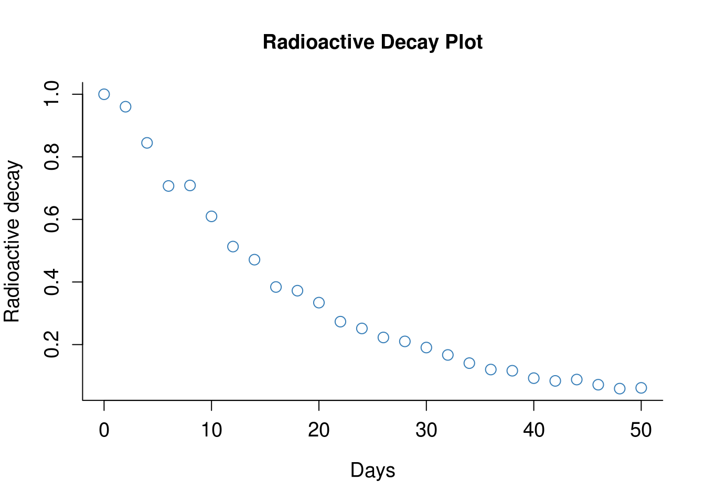

It is possible for us to fit a non-linear model to this data. We're not going to cover non-linear modelling in this material, but it is covered elsewhere in the R book.

The code below (.70 in the R book) fits an exponential model to this data


```r
lines(
  x = xv,
  y = exp(-0.055*xv)
)
```

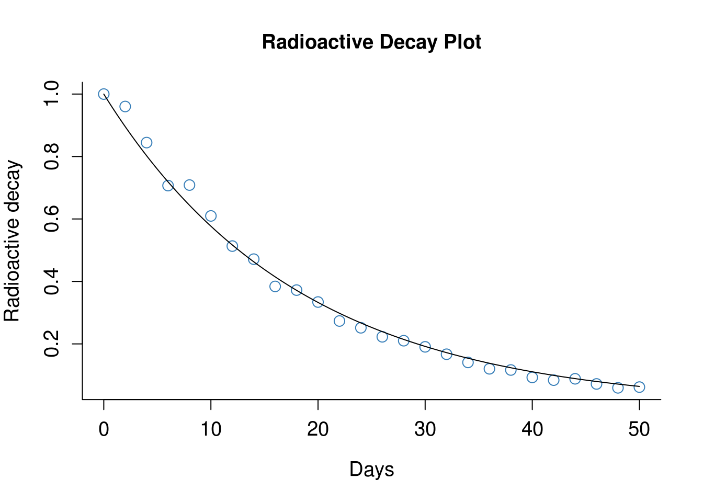

In general however, it is easier if we can linearise our data somehow. For plots, this can be achieved in two ways in R. Either we add the command `log="x"` to convert the x-axis to a base 10 logarithmic scale (or you can specify `"y"` or `"xy"` for both), or we can convert the data itself before plotting using the `log10()` command.

<div class="ex">

### Exercise 

Reproduce the above graph again, but this time try specifying `log="y"`.Then try by converting `y` to a logarithmic scale with `log10(y)`. You should produce the two plots below:


</div>


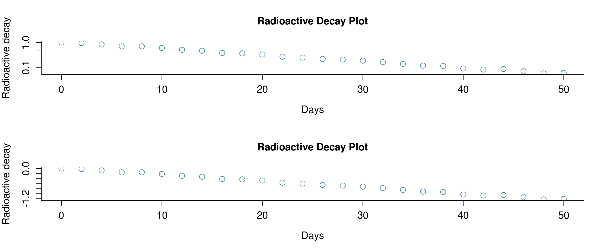

Notice that when we log the axes rather than the data, the axis labels remain a lot more comprehensible.

We are now able to fit a linear model to this data, which is mathematically simpler than specifying a non-linear model.


```r
abline(
  lm(
    formula = log10(y)~x, 
    data = sapdecay
  )
)
```

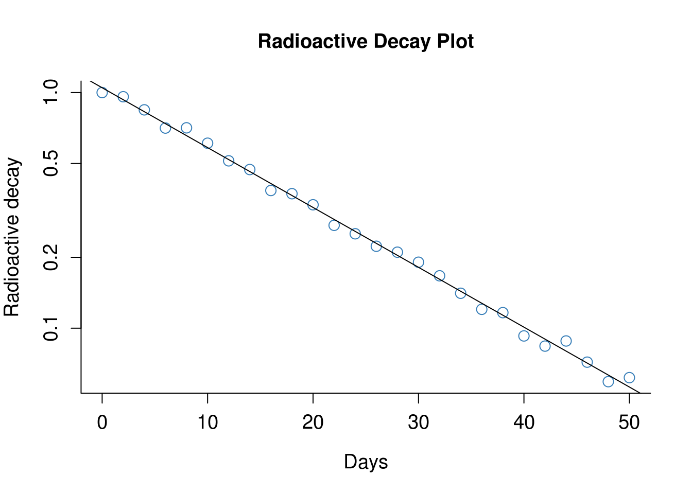


### Customising white space 

So by now, you may be realising that pretty much everything in R plots can be customised. This includes the amount of whitespace you leave around your plots. This can very useful to change when you are creating two plots next to each other.

I'm not going to dwell on how to do this, because there are already some excellent guides written on the internet (see: <http://research.stowers-institute.org/efg/R/Graphics/Basics/mar-oma/>).

One of the plots from this page is included below, showing which commands control whitespace around a plot. Maybe take a deep breath first before looking at the code on the website!

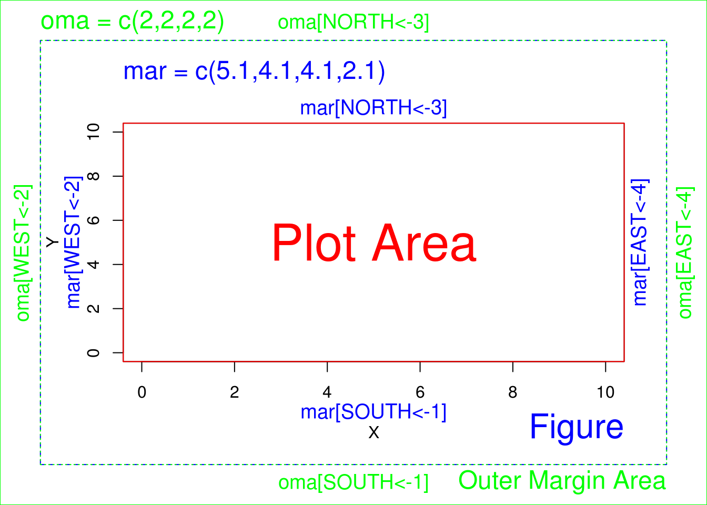

