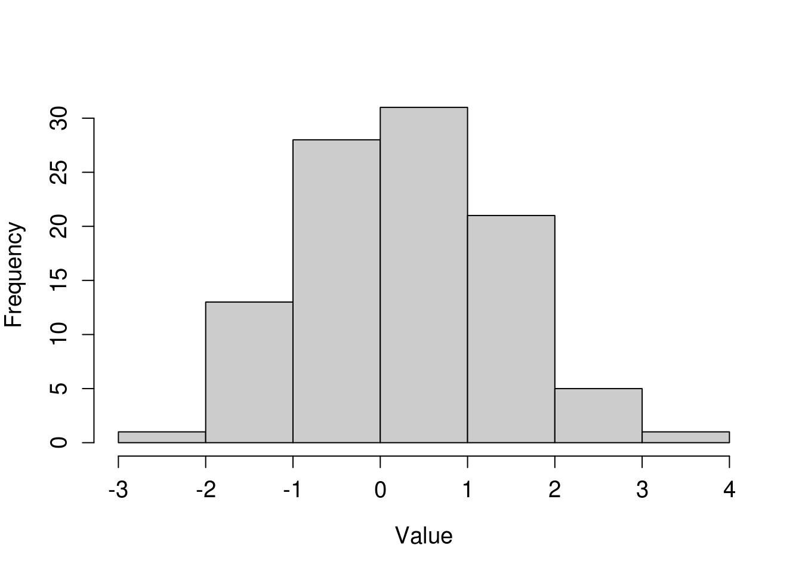
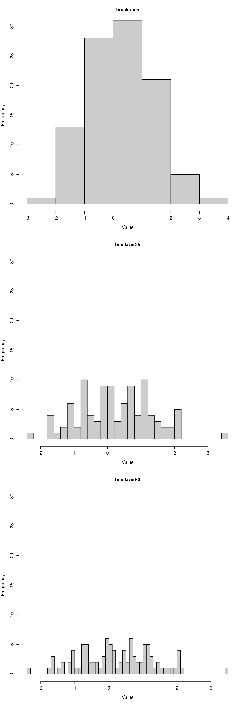
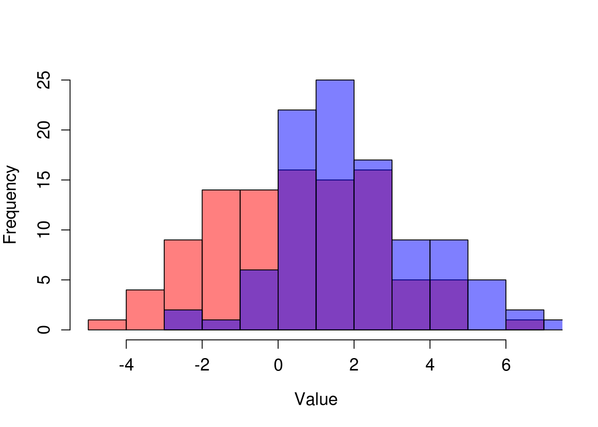
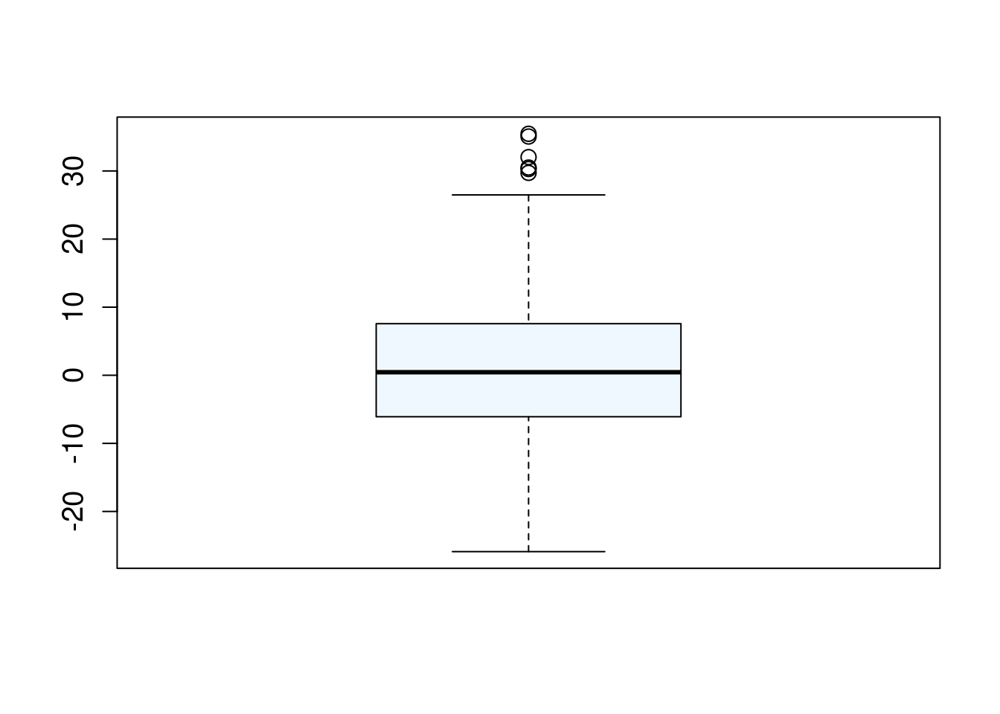
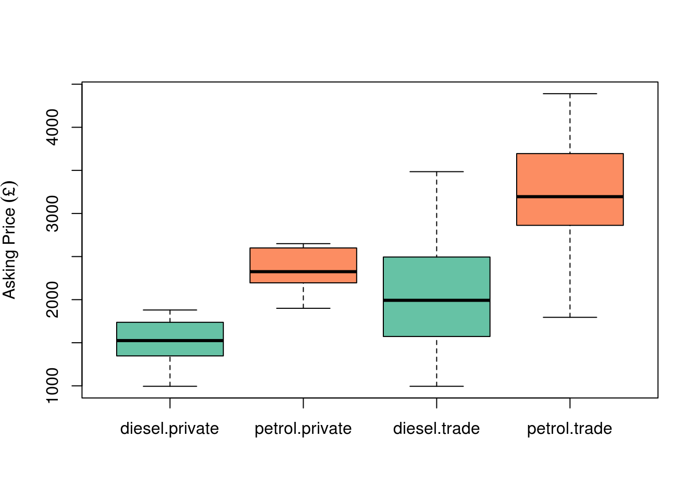

# Histograms and Box and whisker plots 

Histograms and boxplots are two methods of displaying information about the distribution of a dataset.

The good news is that most of the commands that we have covered in the previous section on scatterplots and generic, and they can also be used when producing histograms and boxplots.

### Histograms 

We've already plotted one histogram in the previous section, so let's look again at that plot.

First, we will look at the data.


```r
hist(
  normal_data
)
```


Simple enough. But if like me, you are a little pedantic about your plots, you may also want to make some changes...


```r
hist(
     normal_data,
     main = "",
     xlab = "Value",
     col="gray80",
     cex = 1.4, 
     cex.axis = 1.2, 
     cex.lab = 1.2
     )
```




Bear in mind that we need to make some assumptions when we draw a histogram - i.e. where to choose the break points for the bins (columns). It's usually fine to leave R to make the decision for us, but we can see the result of making changes to the break points below.




You may also at some point wish to compare two histograms by overlaying one over the other. This can be done with a few tweaks, as seen in the example below. Note that we have again had to specify the number of breaks. Hence we have made some assumptions about how to display this data.


```r
set.seed(1337)

# create two normally distributed vectors of random data

data_a <- rnorm(
  100,
  mean = 0,
  sd = 2
)

data_b <- rnorm(
  100,
  mean = 2, 
  sd = 2
)


# Plot first graph

p1<-hist(
  data_a,
  ylim = c(0,25),
  col = rgb(1,0,0,0.5), 
  main = "",
  breaks = 10,
  xlab = "Value",
  cex = 1.4, 
  cex.axis = 1.2, 
  cex.lab = 1.2
)

# Note that you must specify an 'alpha' of less than 1 (the fourth argument in
# the rgb command), otherwise, your two colours will be completely solid. 

# Plot second graph - note use of 'add = TRUE' to overlay onto the first plot

p2<-hist(
  data_b,
  breaks = 10,
  add = TRUE,
  col = rgb(0,0,1,0.5),
  cex = 1.4, 
  cex.axis = 1.2, 
  cex.lab = 1.2
)
```



### Box and whisker plots 

Boxplots similarly display information about the distribution of data, and the have the benefit of not having to make assumptions about bin width. They are not completely free of assumptions however.

A basic boxplot is shown below. 


```r
set.seed(1337)

boxplot_data <- rnorm(
     n = 500,
     sd = 10,
     mean = 1
     )

boxplot(
     x = boxplot_data,
     col = "aliceblue",
     cex = 1.4, 
     cex.axis = 1.2, 
     cex.lab = 1.2
     )
```



In this example the thick line at the centre shows the median, the top and bottom of the box shows the upper and lower quartile, whilst the 'whisker' show the upper and low adjacent values. These are the highest and lowest values within 1.5 times the interquartile range (upper - lower quartile) of the upper and lower quartile respectively. Any values beyond the adjacent values are considered 'outliers' and represented by points.

Note that this is not the only way of representing data in box and whisker plots. The other possibilities are listed here: <http://en.wikipedia.org/wiki/Box_plot>. For this reason, you should always mention what your boxplot is actually showing in the caption.

#### Multiple box plots 

One of the great strengths of the boxplot, is that it allows you to plot several different data sets side by side, in a much more simple and easily comparable manner than with histograms.

<div class="ex">

### Exercise 

In the next example we will use a real dataset which you are required to download from the internet and load into R using the methods we have learnt so far.

The data are available here: <https://db.tt/JEoe3mQZ>

Save this file to your desktop and import it to R, so that R recognises the column headings. Call the new variable `car_prices`.
</div>

This data compares the asking two prices of two cars: one diesel, and one petrol, from 216 car adverts. In the following example we will produce boxplots which compare the asking prices. We need to use the `split()` command for this.

The `split()` command literally splits a dataset according to a particular categorical variable.


```r
# Check the data

str(
  car_prices
)
```

```
## 'data.frame':	216 obs. of  5 variables:
##  $ year : int  2005 2005 2005 2005 2005 2005 2005 2005 2005 2005 ...
##  $ miles: int  91000 113452 114000 157000 117000 98000 91000 88000 72150 110000 ...
##  $ price: int  1795 1900 1945 1989 2000 2195 2250 2295 2350 2350 ...
##  $ type : Factor w/ 2 levels "private","trade": 2 1 2 2 2 1 1 2 2 2 ...
##  $ fuel : Factor w/ 2 levels "diesel","petrol": 2 2 2 2 2 2 2 2 2 2 ...
```

```r
# Split it according to fuel type - note the $ operator - this is required in this case

split(
  car_prices$price,
  car_prices$fuel
)
```

```
## $diesel
##  [1] 2590 2995 3485 3295 3295 2545 2871 2951 2195 2690 3250 1795 1495 2495
## [15] 1995 2495 2295 1789 1995 1795 2395 1895 1250 1695 2495 1800 1999 2295
## [29] 1499 1550 2489 2490 2000 2475 1525 2495 1290 1795 1880 1990 1195 1390
## [43] 1750 1787 1770 2500 1600  995 1495 2295 1675 1200 2000 1699 1595 1475
## [57]  999 1199 1650 1290 1200  995  995
## 
## $petrol
##   [1] 1795 1900 1945 1989 2000 2195 2250 2295 2350 2350 2350 2395 2400 2450
##  [15] 2475 2490 2490 2490 2490 2495 2495 2495 2495 2495 2595 2595 2600 2625
##  [29] 2650 2695 2695 2750 2775 2790 2795 2795 2795 2795 2795 2795 2795 2803
##  [43] 2850 2875 2890 2895 2895 2895 2990 2990 2990 2990 2990 2991 2991 2991
##  [57] 2994 2995 2995 2995 2995 2995 2995 2995 2995 2995 2995 2995 2995 2999
##  [71] 3000 3000 3000 3000 3000 3000 3000 3175 3195 3195 3195 3200 3281 3290
##  [85] 3295 3295 3295 3295 3295 3295 3295 3295 3295 3295 3299 3400 3450 3482
##  [99] 3494 3495 3495 3495 3495 3495 3495 3499 3499 3499 3500 3500 3690 3694
## [113] 3695 3695 3695 3695 3695 3695 3695 3699 3795 3795 3795 3795 3795 3795
## [127] 3799 3888 3890 3895 3900 3970 3985 3990 3990 3991 3995 3995 3995 3995
## [141] 3995 3995 3995 3995 4000 4000 4000 4190 4288 4295 4295 4295 4390
```

```r
# This can simply be wrapped by a call to the boxplot() function

boxplot(
  split(
    car_prices$price,
    car_prices$fuel
  ),
  col = c("#66C2A5","#FC8D62")
)
```


We can make additional splits to this dataset if we like, by using a `list` of factors to split the data by.


```r
boxplot(
  split(
    car_prices$price,
    list(
      car_prices$fuel,
      car_prices$type
    )
  ),
  col = c("#66C2A5","#FC8D62"),
  ylab=bquote(Asking~Price~("£")) 
)
```



```r
# Using bquote() is required here to display the £ sign correctly
```

<div class="ex">

### Exercise 

Using the methods above, produce a `boxplot` of the `car_prices` data, splitting teh data by seller `type`

</div>
