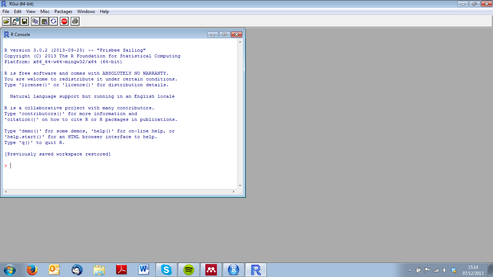

# The R environment {#R_environment}

## The R console

The first thing you will notice when you open `R`, is that there are not a great deal of buttons! In fact, you will be confronted by the window below or the 'R Console'. It is in this window that we can type commands, and in this window that we will get results returned

[](screenshots/R1.png)

While we will get to the more complicated commands that you can pass to `R`via the console, it can also function as a high level calculator.

Throughout this course, when you see text displayed like this:


```r
1 + 2 + 3
```

```
## [1] 6
```

This is essentially a command that has been run in the console, with lines preceded by `##` the response returned in the console. As you go along, you should replicate these commands by copying and pasting the commands into your console window.

Note that there are all the usual functions you would expect from a good scientific calculator...and more.

## The scripting window

The basic `R` installation allows you to write 'scripts' saved as `.R` files, in which you can save your code. You can open a new scripting window by going to the drop-down menu File>New script.

Once here, you can write your codes, and send it to the `R` console by pressing CTRL + r line by line, or CTRL + a to select all and CTRL + r to run all the selected code.

[](screenshots/R2.png)

## The plotting window

When you create a plot, a new window will open, in which your plot will appear. Every time you create a new plot, your old plot will be replaced by the new one. You can prevent this from happening, by running the command `windows()` (windows only!) before creating a plot, which will create a new plotting window, allowing you to keep several plots at any one time.

[](screenshots/R3.png)
